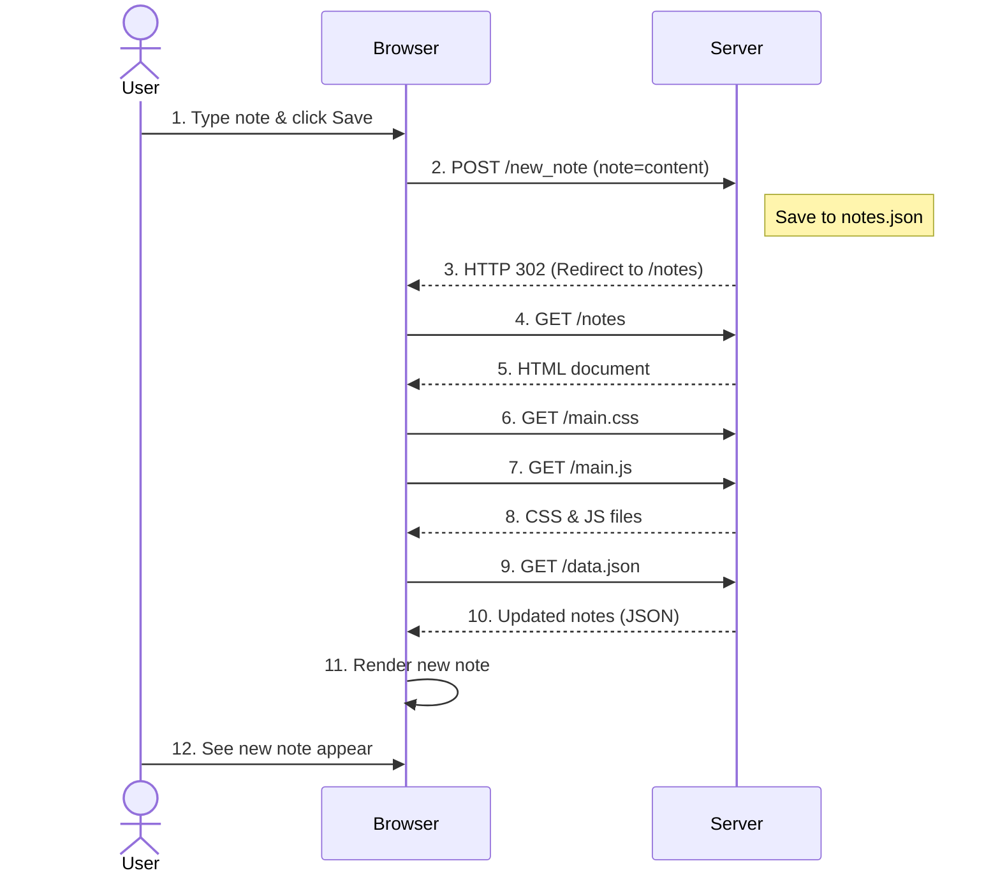

```mermaid
  sequenceDiagram
    actor User
    participant Browser
    participant Server

    User->>Browser: 1. Type note & click Save
    Browser->>Server: 2. POST /new_note (note=content)
    Note right of Server: Save to notes.json
    Server-->>Browser: 3. HTTP 302 (Redirect to /notes)
    Browser->>Server: 4. GET /notes
    Server-->>Browser: 5. HTML document
    Browser->>Server: 6. GET /main.css
    Browser->>Server: 7. GET /main.js
    Server-->>Browser: 8. CSS & JS files
    Browser->>Server: 9. GET /data.json
    Server-->>Browser: 10. Updated notes (JSON)
    Browser->>Browser: 11. Render new note
    User->>Browser: 12. See new note appear
```
