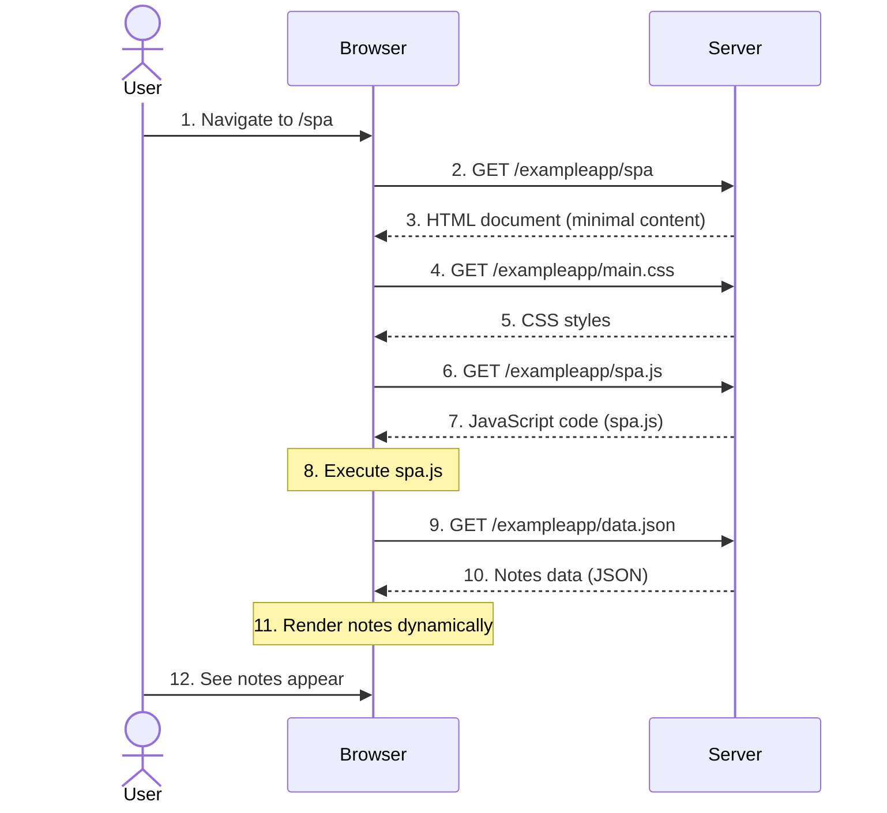

```mermaid
sequenceDiagram
    actor User
    participant Browser
    participant Server

    User->>Browser: 1. Navigate to /spa
    Browser->>Server: 2. GET /exampleapp/spa
    Server-->>Browser: 3. HTML document (minimal content)

    Browser->>Server: 4. GET /exampleapp/main.css
    Server-->>Browser: 5. CSS styles
    Browser->>Server: 6. GET /exampleapp/spa.js
    Server-->>Browser: 7. JavaScript code (spa.js)

    Note over Browser: 8. Execute spa.js
    Browser->>Server: 9. GET /exampleapp/data.json
    Server-->>Browser: 10. Notes data (JSON)
    
    Note over Browser: 11. Render notes dynamically
    User->>Browser: 12. See notes appear
```
