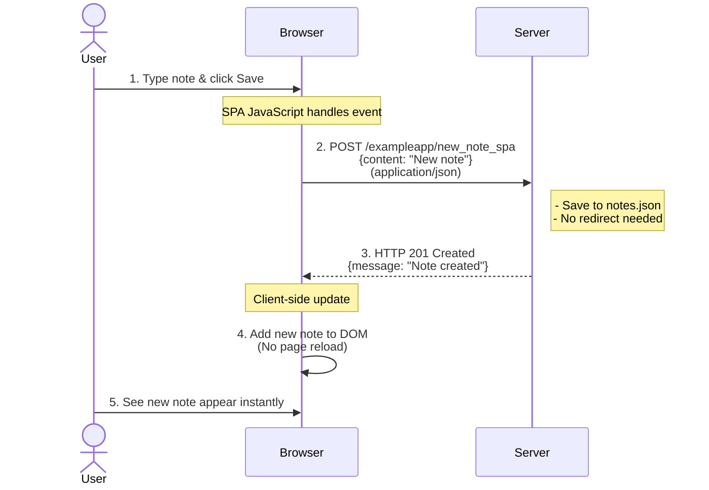

```mermaid
sequenceDiagram
    actor User
    participant Browser
    participant Server

    User->>Browser: 1. Type note & click Save
    Note over Browser: SPA JavaScript handles event
    Browser->>Server: 2. POST /exampleapp/new_note_spa<br>{content: "New note"}<br>(application/json)
    Note right of Server: - Save to notes.json<br>- No redirect needed
    Server-->>Browser: 3. HTTP 201 Created<br>{message: "Note created"}
    
    Note over Browser: Client-side update
    Browser->>Browser: 4. Add new note to DOM<br>(No page reload)
    User->>Browser: 5. See new note appear instantly
```
